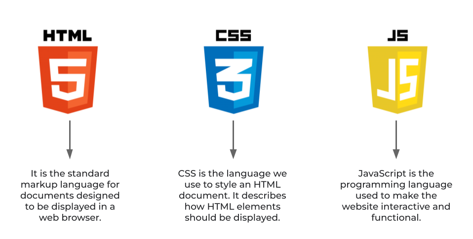

# How does a browser Works?

## Steps taken by the browser from the input of URL till obtaining the response from the server are as follows:

- Browser’s main function is to fetch information from the web and present it to the user.
- A URL has multiple components inside it like scheme, domain, query, path, etc

. 

- When you type a **URL** in the browser, it has to figure out the server from which this webpage is hosted
- for this the browser uses the Domain name embedded in the URL
- Through DNS (Domain Name System) this Domain name is translated into an IP address
- Once the IP address is retrieved the browser it initiates a connection with the server through ISPs (Internet Service Providers)or networks using TCP(Transmission Control Protocol)

- https:// is the scheme. It stands for Hypertext Transfer Protocol Secure. This protocol tells the browser to make a connection to the server using Transport Layer Security. HTTPS makes data exchanged between the browser and the server, like passwords, credit card info, etc. encrypted.
- It is one way of getting till server, but many sites use CDN (Content Delivery Network) to cache static or dynamic content. This is a faster and efficient way of connecting browser to a server
- Once a connection is initiated, browser sends an HTTP (Hypertext Transfer Protocol) request to the server to request the contents of the web page
- This HTTP request contains information for the sever to determine what browser wants to do like
    - GET
    - POST
    - DELETE
    - etc.
- Server then processes this request and decides how to process this request with the help of request line, headers and body embedded in it.
- The server generates a dynamic resource and combines it with HTML to send back in response , as text for the browser to render the page
- once the browser receives this response, it inspects the response header for information about how to render the received resource
- The GET request returns HTML which is the structure of the webpage.
- There’s also other resource and data like JavaScript, CSS, images, etc. which help the browser to render the page.

- The browser engine is the core component of every major browser which transforms HTML documents and other resources into an interactive and visually representable webpage for the user.
- Different browsers use different rendering engines to render and display HTML, XML documents and images.
- examples of rendering engines are:-
    - Google Chrome and Opera browser - Blink
    - Safari browser - WebKit
    - Mozilla Firefox browser - Gecko
    - Internet Explorer - Trident
- To interpret JavaScript code of the website before rendering it to user, JavaScript engines are used. They process scripts incoming along with the response from the server. However, every modern browser engine uses them as a compiler to drive faster results with improved performance.
- examples of JavaScript engines:-
    - Google Chrome - V8
    - Safari browser - Nitro
    - Mozilla Firefox browser - SpiderMokey
    - Internet Explorer and Edge - Chakra
- The primary difference between a Rendering engine and a JavaScript engine is that a rendering engine is tightly coupled with the browser engine, on the other hand, a JavaScript engine can be used outside browser like Node.js, etc.
- All the scripts, whether it’s external script or an inline script are executed in the order they are encountered in the page. HTML is the primary script to be processd then CSS, JavaScript, etc are executed.
- To summaries this process, it can simplified into six steps:-
    1. You type a URL in browser and press Enter
    2. Browser fetches IP address from the Domain
    3. Browser initiates TCP connection with Server
    4. Browser sends HTTP request to Server
    5. Server processes request & sends back a response
    6. Browser renders the recieved content using render engine and JavaScript engine